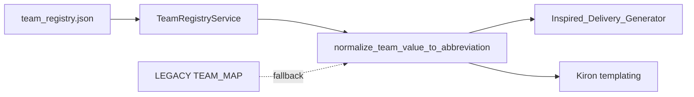

# Team normalization — before / after comparison

Canonical behaviour after this change: **Inspired metadata team fields use 3-letter abbreviations aligned with ENGP filenames.**

Registry: `kiron_export_pipeline/config/team_registry.json` (56 teams).

---

## Example clip: `ARS_SUN_19970115_G_01_ENGP.mp4`

| Field | Previous export | New export |
|-------|-----------------|------------|
| **Filename** | `ARS_SUN_19970115_G_01_ENGP.mp4` | *(unchanged — input basename)* |
| **Home Team** | `Sunderland` | **`SUN`** |
| **Away Team** | `Arsenal` | **`ARS`** |
| **Attacking Team** | `Arsenal` | **`ARS`** |
| **Defending Team** | `Sunderland` | **`SUN`** |

Metadata Home/Away now **matches the filename team pair as an unordered set** (see validation below).

---

## Filename vs metadata validation (corrected)

Inspired filenames use **alphabetical team order**, not Home-then-Away:

```
ARS_SUN_20050807_G_03_ENGP.mp4
 │   │
 │   └── second team (alphabetically after ARS)
 └────── first team (alphabetically first)
```

| | Value |
|---|--------|
| **Filename team set** | `{ARS, SUN}` (order in name is alphabetical only) |
| **Home Team (metadata)** | `SUN` |
| **Away Team (metadata)** | `ARS` |

### Previous (incorrect) validation

Compared filename position 1 → Home and position 2 → Away, producing false warnings:

> Home Team metadata 'SUN' != filename home code 'ARS'

### New (correct) validation

Compares **sorted sets**:

| Check | Result |
|-------|--------|
| `sorted(filename teams)` | `['ARS', 'SUN']` |
| `sorted(Home, Away)` | `['ARS', 'SUN']` |
| **Match?** | **Yes** — no warning |

Home/Away semantics in metadata are **unchanged**; only the validator logic was wrong.

### When a warning still fires

| Filename | Home | Away | Warning |
|----------|------|------|---------|
| `ARS_SUN_…` | `ARS` | `CHE` | filename pair `['ARS','SUN']` ≠ metadata pair `['ARS','CHE']` |

---

## Variant resolution (alias enrichment)

| Source value (Iconik / CSV) | Previous | New |
|-----------------------------|----------|-----|
| `Manchester United` | `Manchester United` | **`MNU`** |
| `Man United` | `Man United` | **`MNU`** |
| `Manchester Utd` | `Manchester Utd` | **`MNU`** |
| `Brighton & Hove Albion` | `Brighton & Hove Albion` | **`BHA`** |
| `Spurs` | `Spurs` | **`TOT`** |
| `Wolves` | `Wolves` | **`WOL`** |

---

## Already-abbreviated input (passthrough)

| Source value | Previous | New |
|--------------|----------|-----|
| `ARS` | `ARS` | **`ARS`** |
| `ars` | `ars` or `ARS` | **`ARS`** |

---

## Unknown team (safe failure)

| Source value | Previous | New |
|--------------|----------|-----|
| `Example FC` | `Example FC` | **`Example FC`** (preserved) |

Additionally:

- Warning in delivery log: `unknown team (no registry match): 'Example FC'`
- Row in `reports/unknown_teams.csv`:

```csv
filename,column,original_value,detail
MY_TEAM_20200101_G_01_ENGP.mp4,Home Team,Example FC,"unknown team (no registry match): 'Example FC'"
```

Delivery still completes (with warnings) — **no silent wrong abbreviation**.

---

## Non-alphabetical filename order (optional QC)

If teams in the filename are not alphabetically ordered (e.g. `SUN_ARS_…` instead of `ARS_SUN_…`):

| Warning |
|---------|
| `filename team codes not in alphabetical order ('SUN' before 'ARS'); expected deterministic ALPHABETICAL_TEAM_A_TEAM_B ordering` |

---


## `inspired_metadata.xlsx` column summary

| Column | Format |
|--------|--------|
| Home Team | 3-letter |
| Away Team | 3-letter |
| Attacking Team | 3-letter |
| Defending Team | 3-letter |
| Country, Season, Match Date, … | *(unchanged rules)* |

---

## Kiron metadata pipeline (unchanged UI, shared logic)

When **Abbreviate Team Names** is enabled in Kiron metadata tab:

- Same resolution order via `team_registry.normalize.resolve_team_abbreviation_with_bridge`
- `TEAM_MAP` remains as fallback (not removed)

---

## Architecture diagram


