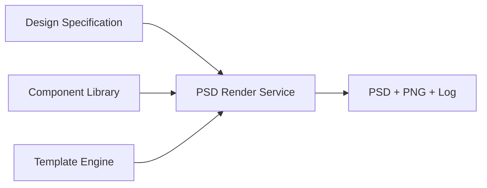

# PSD Rendering Architecture

## Overview

The Production PSD Renderer is a **data-driven** subsystem that writes layered Photoshop output from a Design Specification. It contains no jersey-specific logic and never hard-codes PSD layer names.

| Source | Responsibility |
|--------|----------------|
| **Design Specification** | What to render (colours, patterns, component references) |
| **Component Library** | Which catalogue assets to load |
| **Template Engine** | Where to place assets (layer mappings, Smart Objects) |
| **PSD Renderer** | Orchestrate the 10-stage pipeline |

## Subsystem layout

```
services/psd_rendering/
├── psd_render_service.py          PSDRenderService — pipeline orchestration
├── smart_object_render_service.py SmartObjectRenderService — SO content replacement
├── layer_colour_service.py        LayerColourService — colour tinting
├── pattern_placement_service.py   PatternPlacementService — pattern scale/rotation/opacity
├── texture_placement_service.py   TexturePlacementService — material textures
├── layer_visibility_service.py    LayerVisibilityService — optional layer toggles
├── psd_export_service.py          PSDExportService — PSD, PNG, render log
├── psd_render_validator.py        PSDRenderValidator — pre/post validation
└── render_queue.py                PSDRenderQueue — sequential multi-project queue

services/psd_renderer_service.py   Project integration, history, queue API
services/template_engine/manager.py  open_template_psd() — sole PSD entry point
```

## PSD loading rule

PSD files are **never opened outside the Template Engine**. `TemplateManager.open_template_psd(template_id)` resolves the registered path from `config/templates/` and is the only application entry point for source templates.

The renderer copies the template to a working file in the project export folder before mutation.

## Data flow



## UI integration

| Component | Role |
|-----------|------|
| **Render Production PSD…** menu action | Starts render with progress dialog |
| **PSD Render Progress Dialog** | Stage, elapsed time, layer, warnings, errors |
| **Renderer Inspector** | `update_psd_render()` — timings, mappings applied |
| **Project History** | Render Started / Completed / Failed / PSD Saved / PNG Generated |

## Logging

Every pipeline stage is logged with duration in milliseconds. Render logs are written as `render_log.json` alongside outputs.

## Related documents

- [Smart Object Workflow](SMART_OBJECT_WORKFLOW.md)
- [Rendering Pipeline](RENDERING_PIPELINE.md)
- [Export Specification](EXPORT_SPECIFICATION.md)
- [Template Engine Architecture](TEMPLATE_ENGINE_ARCHITECTURE.md)
