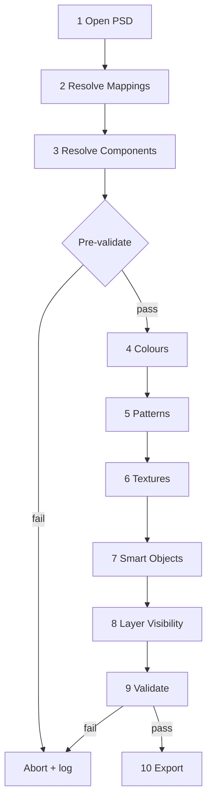

# Rendering Pipeline

## Production PSD pipeline (GJS-011)

The `PSDRenderService` executes **10 stages** in fixed order. Each stage is logged with timing.

| # | Stage | Service | Action |
|---|-------|---------|--------|
| 1 | Open PSD template | Template Engine | Copy registered PSD to working file; open with psd-tools |
| 2 | Resolve template mappings | PSDRenderService | Group `PublishedTemplateMappings` by design spec field |
| 3 | Resolve component IDs | ComponentAssembler | Canonical catalogue IDs from spec |
| 4 | Apply colours | LayerColourService | Tint mapped layers (primary, secondary, accent, sleeve, collar, trim) |
| 5 | Apply patterns | PatternPlacementService + SmartObjectRenderService | Pattern asset with scale, rotation, opacity |
| 6 | Apply textures | TexturePlacementService + SmartObjectRenderService | Material texture on mapped texture layer |
| 7 | Update Smart Objects | SmartObjectRenderService | Collar, sleeve, trim, material components |
| 8 | Toggle optional layers | LayerVisibilityService | Show/hide variants from `layer_visibility.json` |
| 9 | Validate layer state | PSDRenderValidator | Abort if errors; emit warnings |
| 10 | Save rendered PSD | PSDExportService | Layered PSD, preview PNG, render log |

## Pre-validation

Validation runs **before mutation** (after stage 3). Rendering aborts immediately if:

- Required colours are missing
- Catalogue components cannot be resolved
- Mapped PSD layers are absent

## Post-validation

Stage 9 re-runs validation after mutations. Warnings (e.g. unresolved Smart Object ID in analysis) are surfaced in the progress dialog and render log.

## Progress reporting

`PSDRenderProgress` tracks:

- `current_stage` / `completed_stages` / `remaining_stages`
- `current_layer` during per-layer operations
- `elapsed_ms`
- `warnings` / `errors`

## Render queue

`PSDRenderQueue` accepts multiple `ProjectDocument` instances. `PSDRendererService.process_queue()` renders them **sequentially** — parallel rendering is not implemented.

## Architecture diagram

## Relationship to Live Renderer

The **Live Renderer** (alpha.9) produces fast RGBA previews for the UI. The **Production PSD Renderer** (alpha.11) writes Photoshop-compatible layered output using the same Design Specification and catalogue assets, guided by Template Engine mappings.
